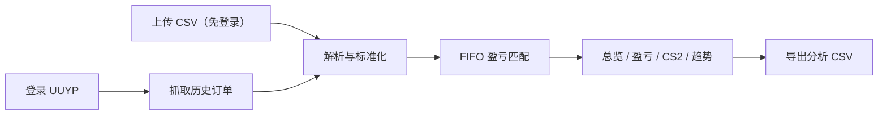

<div align="center">

<h1>悠悠有品交易分析器</h1>
<p><strong>登录后自动抓取 CS2 饰品交易记录，算清每一笔买卖到底赚没赚。</strong></p>
<p>盈亏 · 持仓 · CS2 磨损 · 交易趋势 · CSV 导出</p>

<p>
  <a href="https://github.com/youki258/uuyp-trade-analyzer/stargazers"></a>
  <a href="https://github.com/youki258/uuyp-trade-analyzer/blob/main/LICENSE"></a>
  <a href="https://github.com/youki258/uuyp-trade-analyzer/actions/workflows/ci.yml"></a>
  <a href="https://github.com/youki258/uuyp-trade-analyzer/commits/main"></a>
</p>

<p>
  
  
  
  
  
  
  
</p>

<p>
  <a href="https://youpin.youki.me/"><strong>立即登录并抓取账单</strong></a>
  · <a href="#不想登录直接上传-csv">不登录，直接上传 CSV</a>
  · <a href="docs/deployment.md">自行部署</a>
</p>

[English](README_EN.md) · 中文

</div>

如果你想知道自己的 CS2 饰品交易到底赚了多少，单看订单列表远远不够。UUYP Trade Analyzer 把悠悠有品交易记录整理成可读的盈亏、持仓、趋势和 CS2 场景分析。

<div align="center">
  
  <br><sub>从登录抓取或 CSV 上传开始，示例界面使用脱敏演示数据。</sub>
</div>

## 一条流程，看懂你的交易结果



## 先看结果

<div align="center">
  <table>
    <tr>
      <td></td>
      <td></td>
    </tr>
    <tr>
      <td><sub>解析完成后立即看到交易数量、持仓和已实现盈亏。</sub></td>
      <td><sub>总览买入、卖出、净盈亏、持仓估值和最近交易。</sub></td>
    </tr>
    <tr>
      <td></td>
      <td></td>
    </tr>
    <tr>
      <td><sub>按 FIFO 匹配买入与卖出，查看单品收益和持有天数。</sub></td>
      <td><sub>按磨损等级和武器类型拆解 CS2 饰品表现。</sub></td>
    </tr>
  </table>
</div>

<details>
<summary>查看更多页面：时间趋势与交易明细</summary>

<div align="center">
  <table>
    <tr>
      <td></td>
      <td></td>
    </tr>
  </table>
</div>
</details>

## 功能特性

| 模块 | 能做什么 |
| --- | --- |
| 登录与数据 | 短信、Bearer Token、账号密码登录；按分页抓取买入、卖出及可用租赁订单 |
| 数据导入 | 支持悠悠有品合并账单、买入账单和卖出账单 CSV，可同时上传多个文件 |
| 盈亏分析 | FIFO 匹配、已实现盈亏、持仓成本、单品收益和持有天数 |
| CS2 场景 | 磨损等级分布、磨损盈亏、武器类型分布和明细表 |
| 趋势与明细 | 按日/周/月查看交易趋势，搜索和筛选全部交易记录 |
| 导出 | 导出合并账单、分类型 CSV 和前端分析结果 |
| 安全 | 会话隔离、HttpOnly Cookie、会话/临时文件 TTL、限流、日志脱敏和一次性下载令牌 |

## 快速开始

### 在线使用（推荐）

打开 **[youpin.youki.me](https://youpin.youki.me/)**：

1. 选择短信、Token 或密码登录。
2. 登录后点击“从悠悠有品抓取账单”，等待抓取完成。
3. 加载主账单，进入总览、盈亏、CS2 场景或时间趋势页面。

### 不想登录？直接上传 CSV

在首页拖拽悠悠有品导出的 CSV，点击“开始解析并分析”即可。CSV 路径不需要向服务端提交账号凭证，适合先快速体验分析功能。

### 本地部署

前置要求：Python 3.11+、[uv](https://docs.astral.sh/uv/) 与 Node.js 22+。

```bash
# 构建前端
cd frontend && npm install && npm run build

# 安装后端依赖并启动
cd ../backend && uv sync
uv run python app.py
```

打开 <http://localhost:8765>。完整 Docker、VPS、环境变量和健康检查说明见[部署指南](docs/deployment.md)。

## 数据与隐私边界

当前部署不做长期业务数据持久化，会话和临时导出文件按 TTL 管理；“临时处理”不等于“第三方服务器天然可信”：

- 密码仅用于登录换取 Token；Token 和会话由后端 HttpOnly Cookie 管理，前端不长期持有明文凭证。
- 会话和临时导出文件按 TTL 管理，不做长期业务数据持久化；具体默认值见[部署指南](docs/deployment.md)。
- 日志会对 Token、密码和手机号等字段脱敏；下载使用一次性令牌并受限流保护。
- 请只在你信任的实例中输入凭证，也不要把真实 Token、密码或订单数据提交到 Issue、PR 或截图中。

## 常见问题与风险提示

### VPS 上短信登录失败怎么办？

阿里云、腾讯云等数据中心 IP 可能触发悠悠有品短信风控（常见错误码 5050）。可以改用 Token 登录，或按页面提示完成手动短信验证。详见[IP 风控调研](docs/ip_risk_control_research.md)。

### 为什么总盈亏和已实现盈亏不一样？

总盈亏包含尚未卖出的买入金额；已实现盈亏只统计 FIFO 成功配对的买入与卖出，未卖出部分会保留为持仓。

### 这是悠悠有品官方工具吗？

不是。本项目仅供学习交流使用，与悠悠有品官方无关联，调用非官方接口可能带来账号风控或服务变化风险，请自行评估。

## 深入文档

- [部署指南](docs/deployment.md) — Docker、VPS、环境变量、健康检查和回滚
- [数据字段与导出格式](docs/data-fields.md) — CSV 字段、单位和映射规则
- [开发指南](docs/development.md) — 本地开发、测试、CI/CD 和安全规范
- [自动部署说明](docs/automated-deployment.md) — GHCR + GitHub Actions + VPS 部署链路
- [API 调研](docs/api_research.md) — 接口背景、数据范围和已知限制
- [IP 风控调研](docs/ip_risk_control_research.md) — 登录风控与合规优先策略

## 许可证

[MIT](LICENSE)
