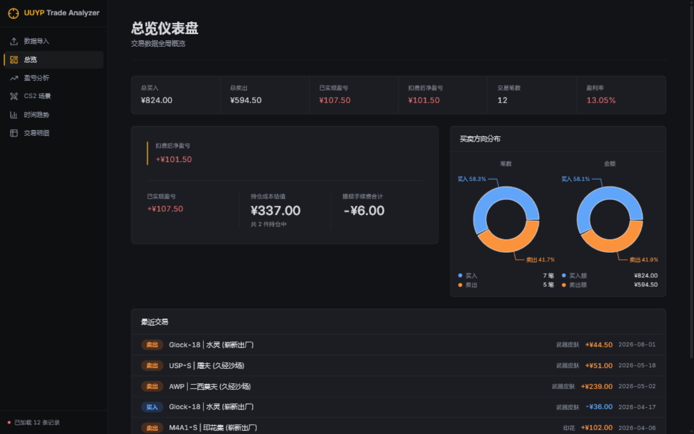

<div align="center">

<h1>UUYP Trade Analyzer</h1>
<p><strong>Export and analyze your CS2 skin trading history from 悠悠有品 — zero setup needed.</strong></p>


[English](README_EN.md) · [中文](README.md)

</div>

UUYP does not offer any official CSV or Excel export. This project calls UUYP's mobile API to automatically fetch all your trade orders, exports them as CSV, and visualizes profit/loss through an interactive dashboard.

---

## Try It Now

**👉 [https://youki.me](https://youki.me)** — hosted service, ready to use. No registration, no installation. Open it in your browser and start fetching.

<sub>Your session is isolated and temporary. Nothing is stored on the server.</sub>

### Run Locally

Prerequisites: Python 3.11+ with [uv](https://docs.astral.sh/uv/), Node.js 22+.

```bash
# 1. Build the frontend
cd frontend && npm install && npm run build

# 2. Install backend dependencies
cd ../backend && uv sync

# 3. Start the server
uv run python app.py
```

Open http://localhost:8765.

---

## Features

- 🔑 **Multiple login methods** — Bearer token, SMS verification code, or account password
- 📥 **Full data fetch** — Paginated buy, sell, lease-in, lease-out orders with auto-retry
- 📄 **CSV export** — Combined sheet or per-type exports, one-click download
- 📊 **Visual analysis** — FIFO profit/loss matching, wear-level breakdown, weapon-type distribution, time trends
- 🛡 **Security** — Two-layer rate limiting, one-time download tickets, log redaction

<div align="center">
  
  <br><sub>Dashboard — real-time trade overview and profit/loss summary.</sub>
</div>

---

## Notes

VPS users (Alibaba Cloud, Tencent Cloud, etc.) may encounter SMS risk control (code 5050) — token login always works. See [IP Risk Control](docs/ip_risk_control_research.md) for details.

This project is for educational purposes only and is not affiliated with 悠悠有品. Using unofficial APIs carries risk of account restrictions.

---

## License

[MIT](LICENSE)