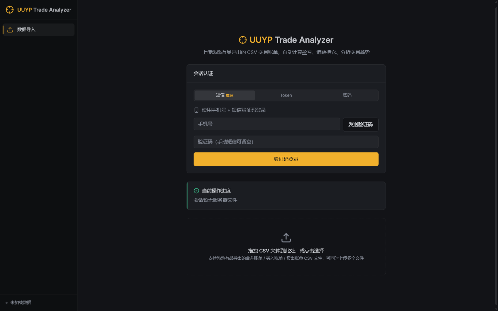
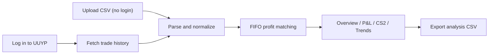
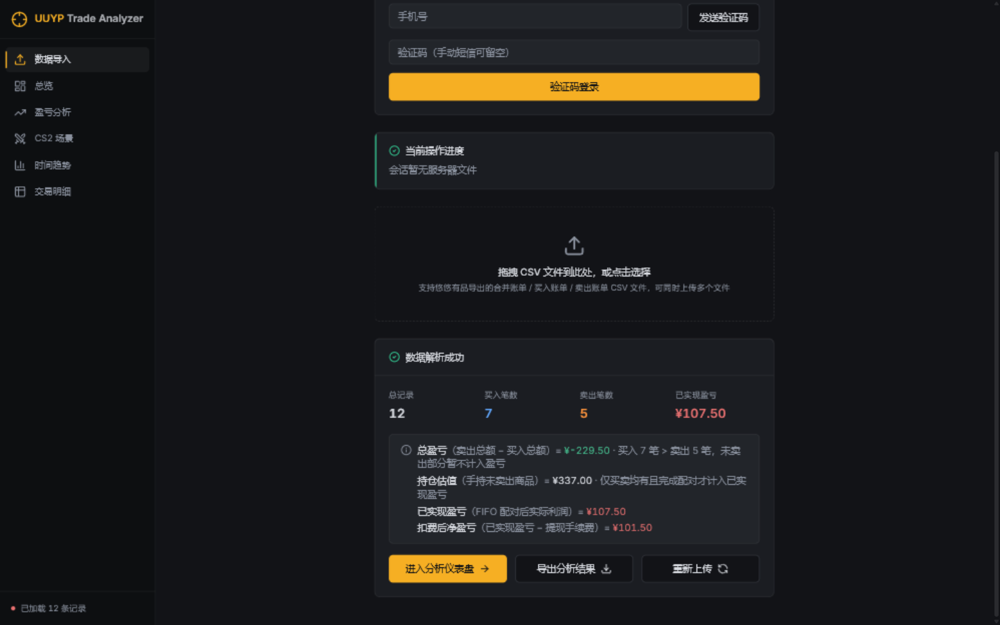
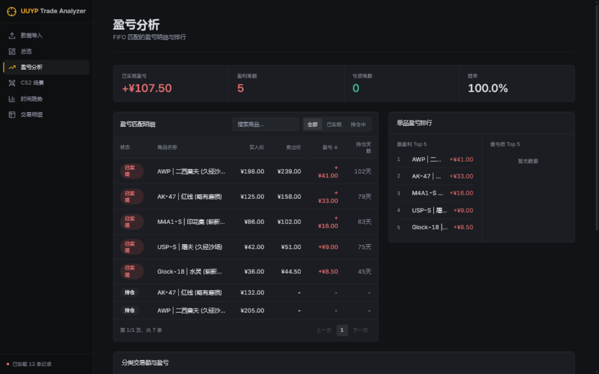
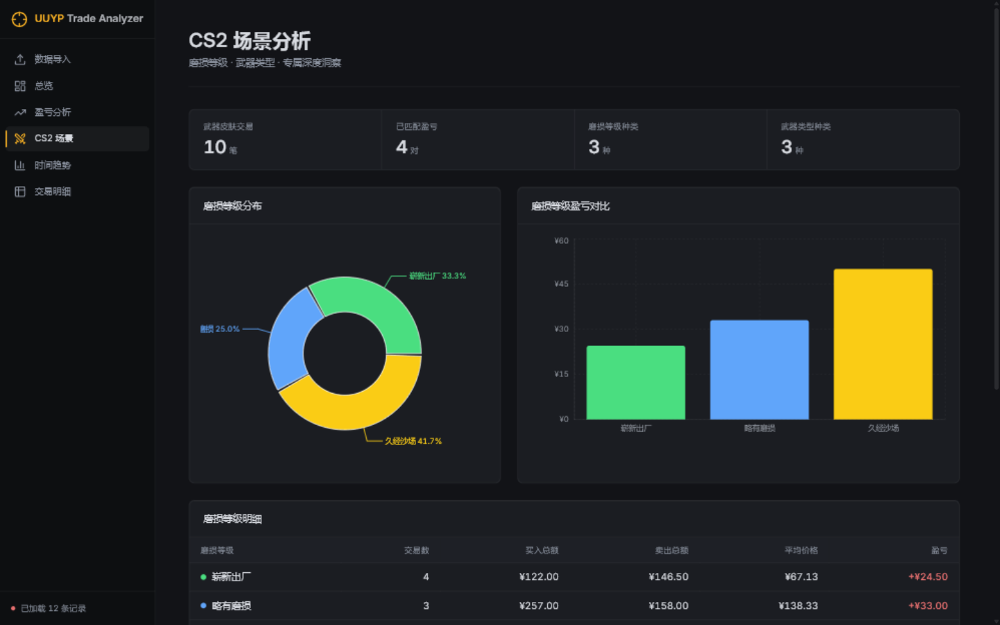
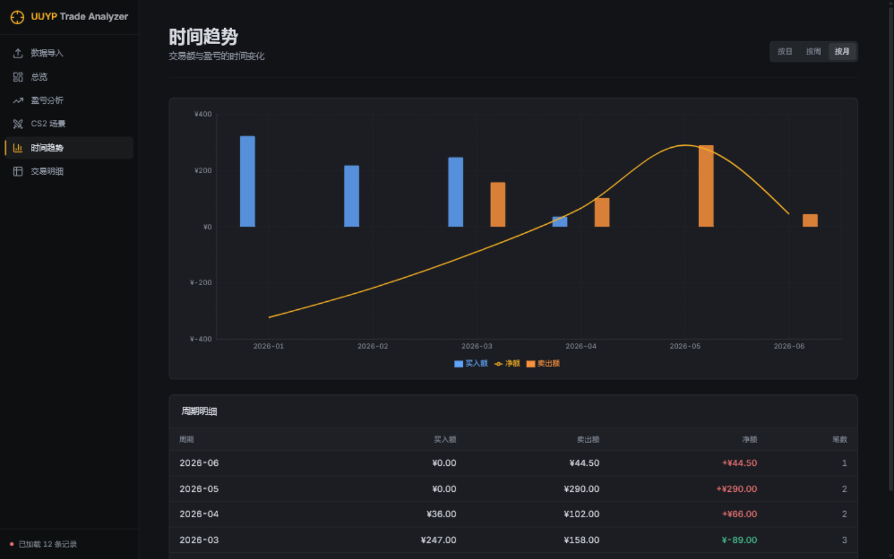
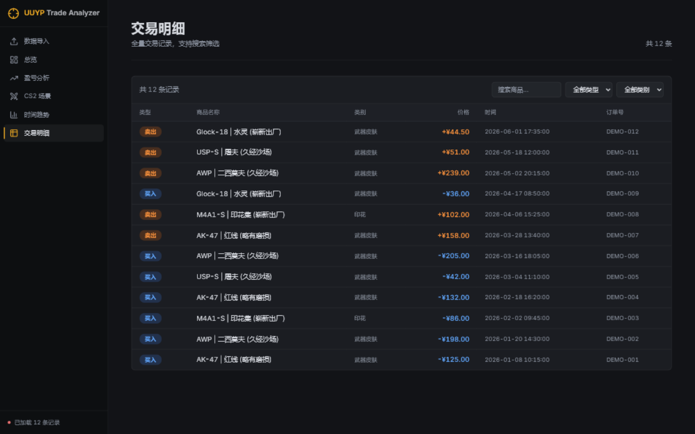

<div align="center">

<h1>UUYP Trade Analyzer</h1>
<p><strong>Fetch your CS2 skin trading history and finally see what you actually made.</strong></p>
<p>Profit & Loss · Holdings · CS2 Wear · Trends · CSV Export</p>

<p>
  <a href="https://github.com/youki258/uuyp-trade-analyzer/stargazers"></a>
  <a href="https://github.com/youki258/uuyp-trade-analyzer/blob/main/LICENSE"></a>
  <a href="https://github.com/youki258/uuyp-trade-analyzer/actions/workflows/ci.yml"></a>
  <a href="https://github.com/youki258/uuyp-trade-analyzer/commits/main"></a>
</p>

<p>
  
  
  
  
  
  
  
</p>

<p>
  <a href="https://youpin.youki.me/"><strong>Open the hosted analyzer</strong></a>
  · <a href="#upload-csv-without-logging-in">Upload CSV without logging in</a>
  · <a href="docs/deployment.md">Self-host it</a>
</p>

English · [中文](README.md)

</div>

UUYP Trade Analyzer turns 悠悠有品 CS2 trading records into readable profit/loss, holdings, trend, and CS2-specific analysis.

<div align="center">
  
  <br><sub>Start with account-based fetching or upload a CSV. Screenshots use sanitized demo data.</sub>
</div>

## One workflow from orders to insights



## See the result

<div align="center">
  <table>
    <tr>
      <td></td>
      <td></td>
    </tr>
    <tr>
      <td><sub>See record counts, holdings, and realized profit immediately after parsing.</sub></td>
      <td><sub>Review buy/sell totals, net profit, holdings value, and recent trades.</sub></td>
    </tr>
    <tr>
      <td></td>
      <td></td>
    </tr>
    <tr>
      <td><sub>Match buys and sells with FIFO to inspect per-item returns and holding days.</sub></td>
      <td><sub>Break down CS2 performance by wear level and weapon type.</sub></td>
    </tr>
  </table>
</div>

<details>
<summary>More screens: trends and trade details</summary>

<div align="center">
  <table>
    <tr>
      <td></td>
      <td></td>
    </tr>
  </table>
</div>
</details>

## Features

| Area | What it provides |
| --- | --- |
| Authentication and data | SMS, Bearer Token, or password login; paginated buy, sell, and available lease-order fetching |
| Data import | Combined, buy, and sell CSV files from 悠悠有品; multiple files supported |
| Profit analysis | FIFO matching, realized P&L, holdings cost, per-item returns, and holding days |
| CS2 analysis | Wear-level distribution, wear-level P&L, weapon-type breakdowns, and detail tables |
| Trends and details | Daily/weekly/monthly trends plus searchable and filterable trade records |
| Export | Combined bills, per-type CSV files, and frontend analysis results |
| Security | Isolated sessions, HttpOnly cookies, session/artifact TTLs, rate limiting, log redaction, and one-time download tickets |

## Quick start

### Hosted service

Open **[youpin.youki.me](https://youpin.youki.me/)**:

1. Choose SMS, Token, or password login.
2. After authentication, choose “Fetch bills from 悠悠有品” and wait for the job to finish.
3. Load the main bill and open the overview, profit, CS2, or trend pages.

### Upload CSV without logging in

Drag a 悠悠有品 CSV onto the import page and choose “Parse and analyze”. This path lets you try the analysis without submitting account credentials to the server.

### Run locally

Requirements: Python 3.11+, [uv](https://docs.astral.sh/uv/), and Node.js 22+.

```bash
# Build the frontend
cd frontend && npm install && npm run build

# Install backend dependencies and start
cd ../backend && uv sync
uv run python app.py
```

Open <http://localhost:8765>. See the [deployment guide](docs/deployment.md) for Docker, VPS, environment variables, and health checks.

## Data and privacy boundaries

The current deployment does not persist business data long term; sessions and temporary export artifacts are managed with TTLs. Temporary processing does not make a third-party server automatically trustworthy:

- Passwords are used only to exchange for a Token. Tokens and sessions are managed through HttpOnly cookies; the frontend does not retain plaintext credentials long term.
- Sessions and temporary export artifacts are managed with TTLs rather than long-term business-data persistence. See the [deployment guide](docs/deployment.md) for defaults.
- Logs redact Token, password, phone, and related fields. Downloads use one-time tickets and rate limits.
- Use credentials only on an instance you trust. Never put real Tokens, passwords, or private order data in Issues, pull requests, or screenshots.

## FAQ and risk notes

### What if SMS login fails on a VPS?

Data-center IPs such as Alibaba Cloud or Tencent Cloud may trigger UUYP SMS risk control, commonly error 5050. Try Token login or the manual SMS flow shown in the UI. See the [IP risk-control research](docs/ip_risk_control_research.md).

### Why are total P&L and realized P&L different?

Total P&L includes purchases that have not been sold. Realized P&L only counts successfully matched buy/sell pairs under FIFO; unsold items remain holdings.

### Is this an official 悠悠有品 tool?

No. This project is for learning and exchange, is not affiliated with 悠悠有品, and uses unofficial interfaces that may carry account or service-change risks.

## Documentation

- [Deployment guide](docs/deployment.md) — Docker, VPS, environment variables, health checks, and rollback
- [Data fields and exports](docs/data-fields.md) — CSV fields, units, and mapping rules
- [Development guide](docs/development.md) — local development, tests, CI/CD, and security conventions
- [Automated deployment](docs/automated-deployment.md) — GHCR + GitHub Actions + VPS
- [API research](docs/api_research.md) — interface background, data scope, and known limits
- [IP risk-control research](docs/ip_risk_control_research.md) — login risk and compliance-first strategy

## License

[MIT](LICENSE)
